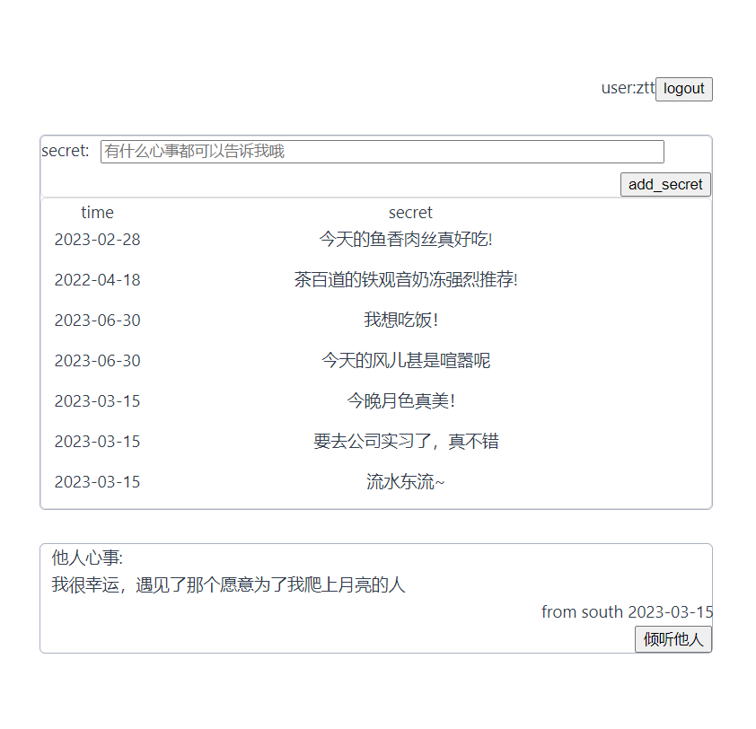

# 界面
登录界面  
  
用户界面  


# 使用

## 数据库创建
```shell
# 安装服务器
sudo apt install mysql-server
# 安装客户端
sudo apt install mysql-client
# 安装 c++库
sudo apt install libmysqlcppconn-dev

# 配置用户账号密码和代码中对应
# 默认为 root 123456z

# 创建数据库
CREATE DATABASE miniserver;
CREATE TABLE IF NOT EXISTS users(
    user_id BIGINT(20) UNSIGNED AUTO_INCREMENT,
    user_name VARCHAR(40) NOT NULL,
    user_passwd VARCHAR(40) NOT NULL,
    PRIMARY KEY (user_id)
);
CREATE TABLE IF NOT EXISTS secrets(
    secret_id BIGINT(20) UNSIGNED AUTO_INCREMENT,
    secret VARCHAR(300) NOT NULL,
    user_id BIGINT(20) UNSIGNED,
    time DATE NOT NULL,
    PRIMARY KEY (secret_id)
);
```

# 各部分设计思路
## buffer
    对外界提供读写功能，内部使用`vector<char>`实现，使用`atomic`类型的`write_pos_`和`read_pos_`记录读写位置。
## log
    分等级记录日志，内部维护一个log_queue——使用两个cond实现、使用一个写线程一直从queue中获取message写即可。
## mux
    使用epoll实现，内部保存epoll_fd，将其wait后返回值储存在vector<struct epoll_event>中，对外界提供事件fd和event的访问。
## thread_pool
    维护一个function的queue,初始化时创建threadCount个线程，每个线程自动从queue中获取任务，若无法获取，则使用cond休眠，外界添加任务时使用cond唤醒线程即可。
## sql_pool
    采用单例模式，整个代码中只存在一个sql_poll，外部维护一个资源获取即初始化SQLConn，外界与sql创建连接时通过SQLConn交互即可。
    sql_poll维护一个vector<sql::Connection*>，获取连接时使用sem判断是否存在可用连接，从vector中pop一个连接供外界使用。使用sem_wait、sem_post维护资源个数。
## timer
    内部维护一个<timer_id,index>的map，一个TimerNode(cb,time)的vector，使用小根堆获取最早被触发的事件。
    在整个代码中提供两个功能：
    1.为server提供下一次被唤醒的时间间隔。
    2.为到时的事件调用回调函数。
## http_request
    提供对request的parse,对get请求和post请求分别处理。
## http_response
    根据request的parse结果，获取静态资源或查询数据库，返回response
## http_conn
    整合http_request和http_response的工作。
## server
    维护一个timer、一个epoller、一个thread_pool_、一个<int,HttpConn>的map。自己完成新线程的创建，调用thread_pool_进行conn的读、写、处理工作。

# 前后端交互
## 事件描述
制作一个树洞，实现用户的注册，登录，登出功能。
用户可以向树洞倾诉自己的秘密、删除自己的秘密，其他用户可以选择倾听别人的秘密。
```json
{
    "brain_twister_id" : "xxx",
    "user_id": "xxx",
    "secret_id" : "xxx",
    "secret" : "xxx",
    "time": "时间戳",
}
```

## 服务器交互
- 浏览器发送内容
```text
{
    "action": "register/login/logout/query(查询自己的所有秘密)/random_query(随机获取一个其它用户的秘密)/add/update/delete",
    "action_info": {
        // register
        "user": "xxx",
        "passwd": "xxx",
        // login
        "user": "xxx",
        "passwd": "xxx",
        // logout
        "action_token": "xxx",
        // query:
        "action_token": "xxx",
        // random_query:
        "action_token": "xxx",
        // add
        "action_token": "xxx",
        "time": "2099-01-01",
        "secret": "xxx",
        // update
        "action_token": "xxx",
        "time": "2099-01-01",
        "secret_id": "xxx",
        "secret": "xxx",
        // delete
        "action_token": "xxx",
        "secret_id": "xxx",
    }
}
```
- 服务器返回内容
```text
{
    "action_result": "true/false",
    "result_info": {
        // register
        "action_token": "xxx",
        // login
        "action_token": "xxx",
        // logout
        // query:
        "secrets": [
                {
                  "secret_id": "xxx",
                  "time": "时间戳",
                  "secret": "xxx",
                }
              ]
        // random_query:
        "secrets": [
                {
                  "secret_id": "xxx",
                  "time": "时间戳",
                  "secret": "xxx",
                }
              ]
        // add
        "secret_id": "xxx"
        //add完成后再次执行一下query
        // 发生错误时
        "error_message" :"xxx",
    }
}
```
# 浏览器调试语句
## 控制台调试
- register 
```js
fetch(new Request('action/register',{
    method:'POST', 
    headers: {'Content-Type': 'application/json'},
    body:"{\"action\":\"login\", \"action_info\": {\"user\":\"ztt\", \"passwd\": \"12345\"}}"
})).then((resp)=>{console.log(resp)})
```

- login
```js
fetch(new Request('action/login',{
    method:'POST', 
    headers: {'Content-Type': 'application/json'},
    body:"{\"action\":\"login\", \"action_info\": {\"user\":\"ztt\", \"passwd\": \"12345\"}}"
})).then((resp)=>{console.log(resp)})
```

- logout
```js
fetch(new Request('action/logout',{
    method:'POST', 
    headers: {'Content-Type': 'application/json'},
    body:"{\"action\":\"logout\", \"action_info\": {\"action_token\":\"PKdhtXMmr29n3L0K99eM\"}}"
})).then((resp)=>{console.log(resp)})
```

- add
```js
fetch(new Request('action/add',{
    method:'POST', 
    headers: {'Content-Type': 'application/json'},
    body:"{\"action\":\"add\", \"action_info\": {\"action_token\":\"PKdhtXMmr29n3L0K99eM\", \"time\": \"2023-6-24\", \"secret\":\"我想出去玩!\"}}"
})).then((resp)=>{console.log(resp)})
```

- query
```js
fetch(new Request('action/query',{
    method:'POST', 
    headers: {'Content-Type': 'application/json'},
    body:"{\"action\":\"query\", \"action_info\": {\"action_token\":\"PKdhtXMmr29n3L0K99eM\"}}"
})).then(res => res.blob()).then(
    (resp)=>{let reader = new FileReader();
        reader.onload = () => {
            var text = reader.result;
            console.log(text);
        }
        reader.readAsText(resp, 'utf-8');})
```

- random_query
```js
fetch(new Request('action/random_query',{
    method:'POST', 
    headers: {'Content-Type': 'application/json'},
    body:"{\"action\":\"random_query\", \"action_info\": {\"action_token\":\"PKdhtXMmr29n3L0K99eM\"}}"
})).then(res => res.blob()).then(
    (resp)=>{let reader = new FileReader();
        reader.onload = () => {
            var text = reader.result;
            console.log(text);
        }
        reader.readAsText(resp, 'utf-8');})
```

- update
```js
fetch(new Request('action/update',{
    method:'POST', 
    headers: {'Content-Type': 'application/json'},
    body:"{\"action\":\"update\", \"action_info\": {\"action_token\":\"PKdhtXMmr29n3L0K99eM\", \"time\": \"2023-6-24\", \"secret\":\"我想出去玩!\", \"secret_id\":1}}"
})).then((resp)=>{console.log(resp)})
```

- delete
```js
fetch(new Request('action/delete',{
    method:'POST', 
    headers: {'Content-Type': 'application/json'},
    body:"{\"action\":\"delete\", \"action_info\": {\"action_token\":\"PKdhtXMmr29n3L0K99eM\", \"secret_id\":1}}"
})).then((resp)=>{console.log(resp)})
```

## 前端调试
以安全模式启动谷歌浏览器
```
"C:\Program Files\Google\Chrome\Application\chrome.exe" --disable-web-security --user-data-dir=C:\Program Files\Google\Chrome\Application\userdata
```